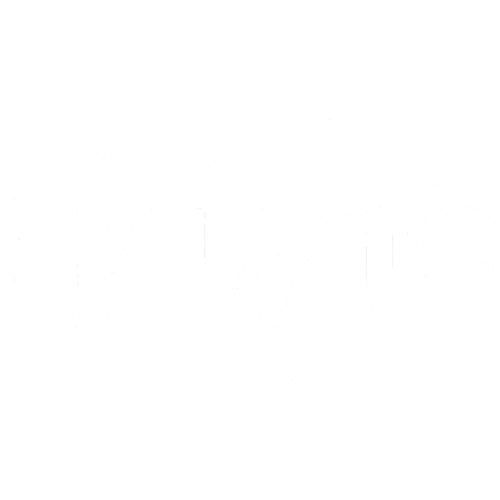

# 

**BuSync - управляйте вашим бизнесом**

_⚙️ In dev: wait_

## Roadmap:
**MVP**
- _Регистрация_ **=> [✅]**
- _Вход_ **=> [✅]**
- _Управление товарами_ **=> [♻️]** <- ждём API
- _БД и таблицы_ **=> [♻️]**

**После MVP:**
- _Управление продажами_ **=> [❌]**
- _Создание простейших Telegram-ботов_ **=> [❌]**
- _Управление контактами_ **=> [❌]**
- _Отчёты_ **=> [❌]**

**Масштаб**
- _User-session_ **=> [❌]**
- _API_ **=> [♻️]**
- _Расширения_ **=> [❌]**